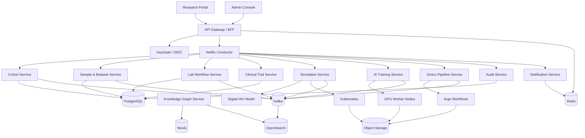

# HIV Cure Research Platform

A multi-technology research platform for HIV cure research workflows, computational simulation, AI-assisted analysis, cohort/sample management, and clinical research coordination.

This project is intentionally framed as a research software platform. It does not encode wet-lab instructions or operational pathogen engineering protocols. The simulation domain models HIV-like behavior abstractly for safe in-silico analysis.

## Architecture North Star



## Technology Map

| Area | Technology |
| --- | --- |
| Web apps | React / Next.js / TypeScript |
| API gateway | Node.js / NestJS |
| Core research services | Java / Spring Boot |
| Clinical trial services | .NET / ASP.NET Core |
| Simulation and AI | Python / FastAPI / PyTorch or JAX |
| Workflow orchestration | Netflix Conductor |
| Compute execution | Kubernetes Jobs, Argo Workflows, GPU nodes |
| Cache and coordination | Redis |
| Events | Kafka |
| Transactional storage | PostgreSQL |
| Objects and model artifacts | S3-compatible object storage |
| Search | OpenSearch |
| Research graph | Neo4j |
| Identity and secrets | Keycloak, Vault / KMS |
| Observability | OpenTelemetry, Prometheus, Grafana, Loki |

## Repository Shape

```text
apps/
  research-portal/
  admin-console/
  api-gateway/

services/
  cohort-service/
  sample-service/
  lab-service/
  clinical-trial-service/
  simulation-service/
  ai-training-service/
  omics-service/
  knowledge-graph-service/
  notification-service/
  audit-service/
  safety-policy-service/

workflow/
  conductor/
    definitions/
    workers/
      java-workers/
      dotnet-workers/
      python-workers/
      node-workers/

infra/
  kubernetes/
  helm/
  terraform/
  observability/
  security/

docs/
  architecture/
```

## First Build Sequence

1. Architecture and workflow documentation.
2. Local Kubernetes development stack.
3. API gateway, auth integration, PostgreSQL, Redis, Kafka.
4. Netflix Conductor deployment and starter workers.
5. Cohort and sample services.
6. Simulation service with safety policy guard and abstract digital HIV model.
7. AI training and omics execution pipelines.

## Current Status

The repository begins with architecture documentation. Implementation should start with the Conductor workflow spine and a safe simulation-service skeleton.
